---

### stack

### focus

- reverse engineering game clients (mostly DDNet / Teeworlds)
- low-level tinkering: memory, protocols, patches
- shipping small tools rather than polishing forever

### projects

- [**archivex.fun**](https://archivex.fun) — archive of DDNet / Teeworlds clients and character artworks.

### contact

- Telegram — [@utf8x](https://t.me/utf8x)
- Channel — [@akrd1337](https://t.me/akrd1337)
- Web — [archivex.fun](https://archivex.fun)
