 

---

### focus

- reverse engineering, low-level tinkering, protocol digging
- occasional DDNet contributions & maps
- shipping small self-hosted tools when the mood hits

### projects

- **archivex.fun** — personal side project. still evolving.
- **ddnet** contributions — patches, maps, community server tweaks.
- private research repos — writeups pushed here when they stop being embarrassing.

### contact

- telegram: [@utf8x](https://t.me/utf8x)
- channel: [@akrd1337](https://t.me/akrd1337)
- web: [archivex.fun](https://archivex.fun)

if it compiles, ship it

